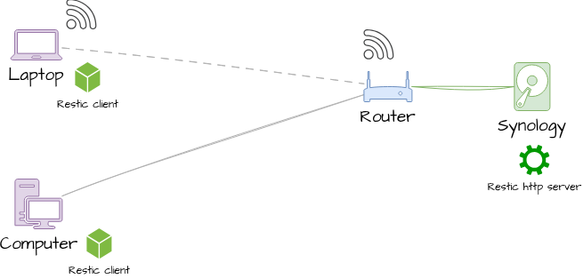

## 🔷 Introduction

### What is this?

A set of bash scripts to 

* Install rest http server on a Synology NAS.
* Service handling: start/stop/status of server
* A user administration for access to private repos; it handles user entries in [webroot]/.htpasswd (using openssl)

### Requirements

* Synology NAS with DSM 7.x

Latest tested versions:

* Restic: 0.14.0
* on Synology DSM 7.3

### What is Restic?

Restic **client**: https://restic.net/ - it is an opensource backup tool. 

It is very fast and uses deduplication. Copy a single to your client binary and use it. 
It stores backup data on (USB) disk, SFTP, S3 or other backend supported by rclone.

To use https as backend there is a **Restic server** as one option. https://github.com/restic/rest-server

If you have a Synology NAS at home then this repository helps you to install that https backend and maintain users.

On your Windows/ Linux/ Mac OS client you additionally need to install the client and configure the backend url of the https server.
