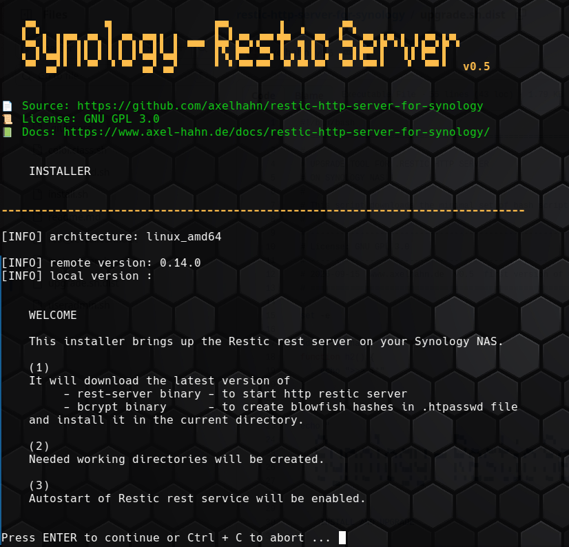

## 🪄 Installation

Remark: since DSM 7.2 (?) `sudo -i` isn't allowed anymore to open a shell as root and execute all commands. All actions are written with sudo in front now.

### Prepare

Web based stuff:

* Login into the web ui of your Synology with an admin user
* Activate DDNS for your NAS
* Activate ssl certificate for your NAS (what is using Let's Encrypt in the background)

### Get sources

Via SSH console:

* Login to your Synology with an admin account
* Create a directory, and get the files of the project there

```shell
# Create directory
sudo mkdir -p /volume1/opt/restic
cd /volume1/opt/restic

# get the sources
sudo curl -o master.tar.gz https://codeload.github.com/axelhahn/restic-http-server-for-synology/tar.gz/refs/heads/master
sudo tar -xzf master.tar.gz
cd restic-http-server-for-synology-master
sudo cp -rp * ..
cd ..
sudo rm -rf restic-http-server-for-synology-master master.tar.gz
```

The result is something like that:

```shell
# ls -1
install.sh
rest_server.conf.dist
rest_server.sh
useradmin.sh
```

### Run installer

Execute `sudo ./install.sh` to download the latest version of the required single binaries of restic rest server and bcrypt and initialize the service.



The reuslt is

```txt
# ls -1
bcrypt
data
install.sh
log
rest-server
rest-server_0.14.0_linux_arm64
rest-server_0.14.0_linux_arm64.tar.gz
rest_server.conf
rest_server.conf.dist
rest_server.sh
useradmin.sh
```

The installer also creates a /usr/local/etc/rc.d/rest_server.sh - which is a softlink to rest_server.sh in your installation directory.
With that link the restic http server will start automatically if your Synology nas is (re-)booting.
