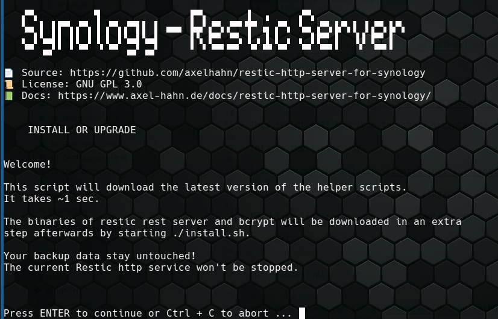

## Installation

Remark: since DSM 7.2 (?) `sudo -i` isn't allowed anymore to open a shell as root and execute all commands. All actions are written with sudo in front now.

### Prepare

Web based stuff:

* Login into the web ui of your Synology with an admin user
* Activate DDNS for your NAS
* Activate ssl certificate for your NAS (what is using Let's Encrypt in the background)

### Get sources

Via SSH console:

* Login to your Synology with an admin account
* Create a directory, and get the files of the project there

#### Variant: download installer/ upgrader

```shell
# Create directory
sudo mkdir -p /volume1/opt/restic
cd /volume1/opt/restic

# get a single script
sudo curl -o upgrade.sh https://raw.githubusercontent.com/axelhahn/restic-http-server-for-synology/refs/heads/master/upgrade.sh.dist
sudo chmod 0755 upgrade.sh
sudo ./upgrade.sh
```



This script will download the shell scripts and afterwards starts the installer.

The upgrade script supports the following options:

```txt
USAGE: upgrade.sh [OPTION]

OPTIONS:
    -h|--help     Show this message
    -y|--yes      Do not ask for confirmation
```


**Hint**:
Add `-y` to the command to skip the confirmation prompt.

```txt
USAGE: install.sh [OPTION]

OPTIONS:
    -h|--help     Show this message
    -y|--yes      Do not ask for confirmation
```

#### Variant: manual installation (legacy)

For historical reasons or if you don't want to use the installer `upgrade.sh`, you perform all install steps manually:

```shell
# Create directory
sudo mkdir -p /volume1/opt/restic
cd /volume1/opt/restic

# get the sources
sudo curl -o master.tar.gz https://codeload.github.com/axelhahn/restic-http-server-for-synology/tar.gz/refs/heads/master
sudo tar -xzf master.tar.gz
cd restic-http-server-for-synology-master
sudo cp -rp * ..
cd ..
sudo rm -rf restic-http-server-for-synology-master master.tar.gz
```

The result is something like that:

```shell
# ls -1
color.class.sh
inc_shared.sh
install.sh*          <<<<<
readme.md
rest_server.conf.dist
rest_server.sh*
upgrade.sh.dist*
useradmin.sh*
```

In the list of files is the installer.

Execute `sudo ./install.sh` to download the latest version of the required single binaries of restic rest server and bcrypt and initialize the service.


The reuslt is:

* bcrypt was installed
* rest-server was installed
* rest_server.conf was created
* dubdirs dta and log were created

```txt
# ls -1
bcrypt/
color.class.sh
data/
docs/
inc_shared.sh
install.sh*
log/
readme.md
rest-server@
rest-server_0.14.0_linux_amd64/
rest-server_0.14.0_linux_amd64.tar.gz
rest_server.conf
rest_server.conf.dist
rest_server.sh*
upgrade.sh*
upgrade.sh.dist*
useradmin.sh*
```

The installer also creates a /usr/local/etc/rc.d/rest_server.sh - which is a softlink to rest_server.sh in your installation directory.
With that link the restic http server will start automatically if your Synology nas is (re-)booting.
