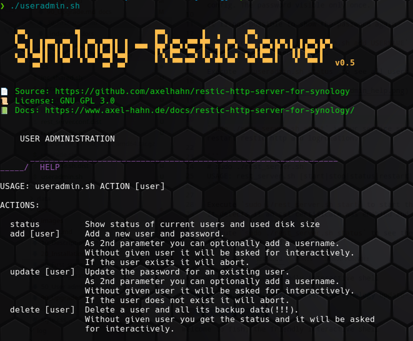

## 🪄 First steps after a fresh installation

### Create a user for http access

The default config activates private repos (see restic http doc for description).
In short: a user [user] gets access to [backup-url]:[port]/[user]/ only ... with its own password.

Execute `./useradmin.sh add USERNAME` to create a user with a generated password (32 chars by default).
Copy and paste the shown password in the output to your restic client config. The password visible only once.

It is not possible to show the password again.

But you can repeat `./useradmin.sh add USERNAME` to set a new password and update the client config.

Execute `./useradmin.sh status` to see all users and their used size.



### Start service

`sudo ./rest_server.sh start` is our service script for start/ stop/ restart restic http and logrotation.

```
# sudo ./rest_server.sh
USAGE: rest_server.sh [start|stop|status|restart|logrotate]
```

Execute `sudo ./rest_server.sh start` to start the restic http server.
It detects if an ssl certificate was enabled and uses https if possible.

Execute `sudo ./rest_server.sh status` to see the process with PID and full path and used port.
