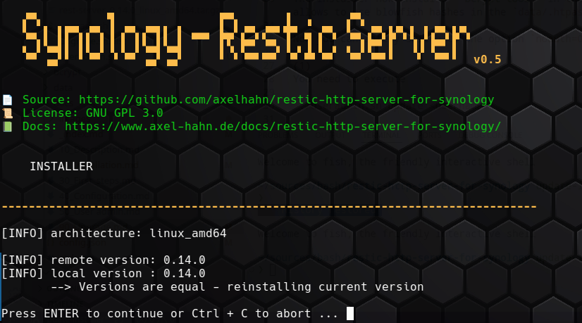

## Upgrade the software

### Update scripts

Execute `sudo ./upgrade.sh` to download the latest versions of the scripts. 


Afterwards it will start the newly downloaded `./install.sh` to download/ upgrade needed binaries. See the next chapter.

**Hint**:
Add `-y` to the command to skip the confirmation prompt.

```txt
USAGE: upgrade.sh [OPTION]

OPTIONS:
    -h|--help     Show this message
    -y|--yes      Do not ask for confirmation
```

### Upgrade Binaries

Execute `sudo ./install.sh` to download the latest version of the required single binaries of restic rest server and bcrypt and initialize the service.



**Hint**:
Add `-y` to the command to skip the confirmation prompt.

```txt
USAGE: install.sh [OPTION]

OPTIONS:
    -h|--help     Show this message
    -y|--yes      Do not ask for confirmation
```


After update/ upgrade:

* run `sudo ./rest_server.sh restart` to restart the restic rest service

If a new Restic rest version was found then delete 

* folder `rest-server_<old-version>*`
* file `rest-server_<old-version>*.tgz`

### Change in Sep 2026

The installer now installs **bcrypt-tool** in the `brypt`subfolder. It allows to use blowfish hashes in the `data/.htpasswd`.

Now you can safely switch to the option `noauth=0` in `rest_server.conf`.

(1)
You need to execute 

`sudo ./useradmin.sh update <username>`

for each user and set the new password on the clients.

(2)
Set the option `noauth=0` in `rest_server.conf`.

(3)
Restart the restic server with `sudo ./rest_server.sh restart` to reread user passwords and the changes in the config file.